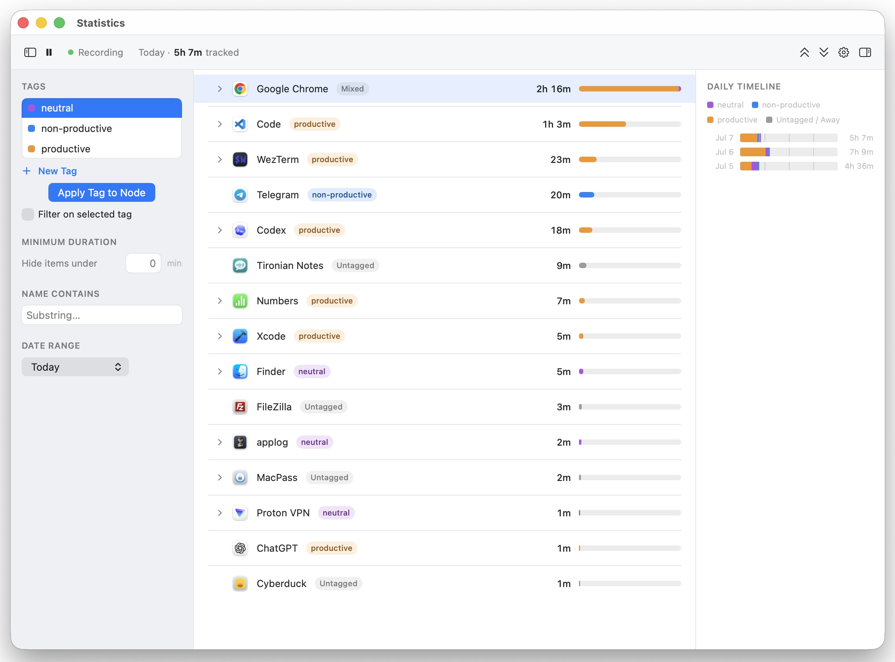

# AppLog

Applog automatically monitors which applications, documents, and websites the user is actively using, and for how long, without requiring manual timers. It lets the user analyze their own usage patterns after the fact, tag time for billing/project purposes, and export reports — all from a lightweight menu bar app.

## Installation

1. Download latest build from [Aplog website](https://sheremetov.com/applog/)
2. Drag & drop the app into Applications
3. Allow to run the app in Privacy & Security section of Settings
4. Run it